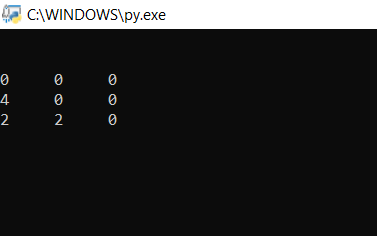

# py2048
The file 2048 in the repo contains The_Game.py, the python code for the game 2048 
As we proceed to run the program, it asks us the **Grid Size** and **The no. till which we want  to run the game**
(the no. being an power of 2). Pressing enter gives us the board of entered  size and a randomly spawned 2 
  
The user needs to play using the keys   **W** for up   **A** for right   **S** for down   **D** for left  
 
On playing **W** (the 2 on left down corner is newly spawned)  
 
Played **A** next  
 
N then **S**  
 
At last, plying **D**   
 
If the matrix remains same after playing a move, the game shows **Invalid Move**  
 
When entered a key other than WASD, it shows us Invalid Input and asks for a valid one  
On running out of spaces to spawn a 2 with no adjacent elements before reaching the no. that we initially  entered, It displays... 
 
And asks us wheather we want to **Play Again**  If we input **Y**, it restarts the game  If the input's **N**. It says 
**Okie Dokie, boi boiii...**
(couldn't attach a screenshot as all that happens in a span of 1-2 secs, u'll knw once you play)  
Finally, when we reach the value that we input at the beginning... 
 
It displays **You Win** and asks us if we want to play again.

